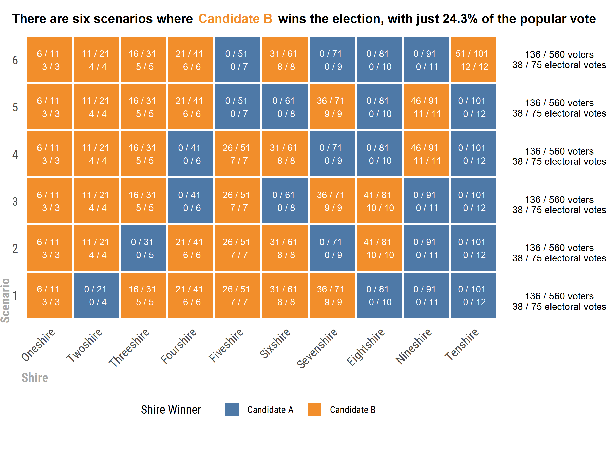

### Riddler Express 07/24/2020

---

>Riddler Township is having its quadrennial presidential election. Each of the town’s 10 “shires” is allotted a certain number of electoral votes: two, plus one additional vote for every 10 citizens (rounded to the nearest 10). [...] If there are two candidates running for president of Riddler Township, and every single citizen votes for one or the other, then what is the lowest >percentage of the popular vote that a candidate can get while still winning the election?

---

For find the solution to this problem, I will 
